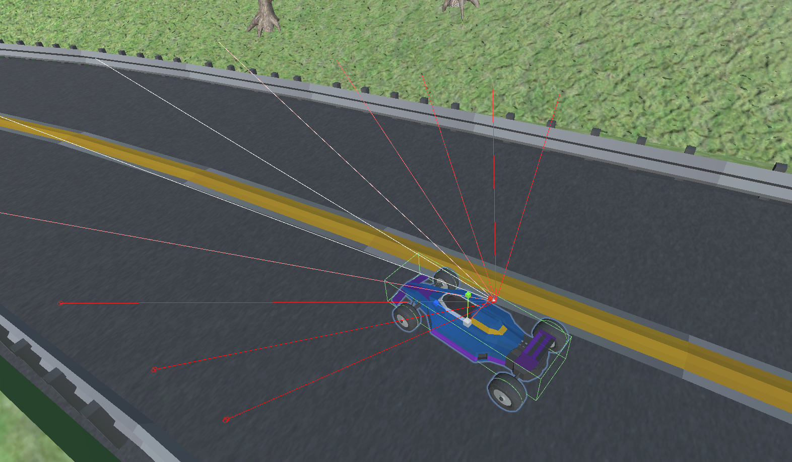

# MLAgentsAtSpa
Unity ML Agent Racing Car learns to Drive at Spa !

#### Video Demo:  https://www.youtube.com/watch?v=xxxxxxx
### Description:

This is an Unity ML- Agents Reinforcement Learning Project.  It emulates a car racing around a long race track with inclines and slopes.  It uses the same prinicples as Code Monkeys ML Agent Race Car emulation : https://www.youtube.com/c/CodeMonkeyUnity 

However I wanted to see if it was possibel to Train an Agent against more challenging longer circuits with slopes and inclines.  To represent driving through the challenging Nurburgring and Spa racing circuits, as opposed to the rather flat Silverstone and modern circuits.   

* * *

* * *
### Race Track Generation 

The Race Track has been modelled in Blender. A road segment with Barriers was modelled, and then an Array Modifer and a Curver Modifer applied to generate the whole Circuit. The .FBX modle was then imported into UNity, and a Mesh collider applied. Seperate models for the Race Track mesh, and the Barreirs Mesh were loaded into Unity, to enable the Barriers render Mesh Object to be disabled, and have its own specific mesh Collider system. 

* * *

* * *
Unity Terrain, Trees and building feature models were added for some interesting track side scenery. (Note this EXCLUDED from the Unity Packeage provided here, to avoid excessive Git Upload files size.) 

As per Code Monkeys ML Agent Race Car Training, I used a Check Point System.  I put in a total of 70x Check Point Trigger Colliders, to monitor progress.
* * *

* * *

### Race Car Agent Configuration 
A basic Race Car was modelled in Blender, an imported into Unity. Wheel Collider dynamics were employed. 

- Rear wheel (collider) Propulsion Torque
- Front wheel (collider) steer

This modelled dynamics provides lots of under steer and sliding dynamics!   It is actully quite challenging to drive around the circuit, avoiding excessive speed, spins and collsions with Barriers. After some practice I was able to acheive a lap time in around 150 seconds. 

The Race Car Agent employs a 3D Ray Cast Sensor, which is configured to intercept the Race Track Barriers. 
* * *

* * *

I added three Scalar Observations:
- Car Speed
- Race Track Incline (Slope of the Race Track)
- Race Car to Track Alignment:  This is a modified Dot Product of the Car Forward vector to a LERPED direction corresponding to the two Check Point Colliders the Car is between. I actually used Alignment = 1.0 – 2.5*(1.0-Vector Dot Product of a LERPED direction)) 

The Actions were simply to Drive the Car through the Wheel Collider Dynamics.  Two driving Action Branches: 

- Branch 1: NOOP, Forward Torque, Braking/Reverse Torque
- Branch 2: NOOP, Steer Right, Steer Left

## Reward Profile
A Positive Reward if the Car reaches the Goal Check Point. A negative Reward if the Car runs out of Time in Seconds. And a small penalty per Barrier Collision:
 -  +1.0 – 0.5* (LapTime / MaxLapTime)  -  Upon Successful Lap/ Final Check point (End Episode) 
-   -1.0  if the agent runs exceeds MaxLapTime (End Episode) 
-   -0.025  per barrier collision

### Incremential Learning
GAIL Imitation learning was employed, to help influcne the Agent through a few checkpoits. So some human demonstrations where provided (CP3Demo, within the demonstrations folder) - But the initial Agnet behaviour was still pretty random, even with a GAIl strtenghth of 0.25.

The main growth in learning was through a slow Incremential Learning Regime.  The Initial Goal, and postive reward, being simply to get to Check Point 1. The Training level was increased upon 20 successive positive goal acheivements. A Decrement in Training level, upon 10 failures was alos implmented. (However a decrementin Training Level was never observed) At each Training Level, the length of the Race Track increased by a single Check point, so a Total of 70+ Training levels, corresponding to the 70 CheckPoint colliders was required to Train the Agent around the whol Track. Initially more optimisitic 5 CP jumps were presuemd per Training level. However the Agent appeared to Struggle to achieve growth across multiple Check Points.    

### ML Agent Training
There was little adjustment and correction to the PPO hyper parameters. The Race Car Agent apperaed to learn reasonbaly easily, al beit very slow, with few changes, revisions to the PPO hyper parameters in the GrandPrixML.yaml configuration. However the training was very sentive to very small increments in the Race Lap length. So Training could only be acheived with Lap length increasing by a single Check Point at a time. So a Total of 70x Training Levels was required, to train the agent to achieve the whole lap.  This was acheived in around 20, Million Training Epochs.    

The final perfomarnce can be seen on the You Tube video. Its quite fun. 

### Conclusions
Fairly robust, albeit rather slow learning. 
The Perfomance of the race car was comparable with a reasonably experienced human player (Myself) with some practice on the same Track. 
I have not tried the agent on different circuits. Theslow growth in per Checkpoint Training, susggests that the Agent perfomance would NOT generalised to alternative Track configurations. 

* * *

### Acknowledgements

- Blender: 3D Modelling :   https://www.blender.org/
- Unity: Game Development : https://unity.com/
- Code Monkey Unity and ML –Agent Tutorials:  https://www.youtube.com/c/CodeMonkeyUnity
- Imphenzia: 3D Blender Modelling : https://www.youtube.com/c/Imphenzia
- Sound Track: Fleetwood Mac: “ The Chain “ : https://www.fleetwoodmac.com
